# Sage 2.2.1

This repository contains files and progress in re-fitting OpenFF 2.2.1,
a patch update to [OpenFF 2.2.0](https://github.com/openforcefield/sage-2.2.0).

The goals of this update were to:

    * re-fit with linear angles set to 180°
    * re-fit Improper torsions as well


Most files in this force field were originally copied from the
[OpenFF 2.2.0](https://github.com/openforcefield/sage-2.2.0)
repository, and then updated or modified.

<!-- vscode-markdown-toc -->
* 1. [Fitting pipeline](#Fittingpipeline)
* 2. [Python environment](#Pythonenvironment)
* 3. [Changes](#Changes)
	* 3.1. [Global benchmarks](#Globalbenchmarks)
	* 3.2. [Sulfamide angles remain similar to 2.2.0](#Sulfamideanglesremainsimilarto2.2.0)
	* 3.3. [3-membered ring angle parameters remain similar to 2.2.0](#memberedringangleparametersremainsimilarto2.2.0)
	* 3.4. [Linear angles stay linear.](#Linearanglesstaylinear.)
* 4. [Parameter changes](#Parameterchanges)
	* 4.1. [Bond, improper, and proper torsion parameters don't change much](#Bondimproperandpropertorsionparametersdontchangemuch)
	* 4.2. [Several angle parameters change substantially](#Severalangleparameterschangesubstantially)

<!-- vscode-markdown-toc-config
	numbering=true
	autoSave=true
	/vscode-markdown-toc-config -->
<!-- /vscode-markdown-toc -->

##  1. <a name='Fittingpipeline'></a>Fitting pipeline
The code that was used to produce the fit is all included here, and should be reproducible. The fit is performed in several steps, with instructions for how to run each step in the `README` file in each directory:

1. `01_generate-forcefield`: Generate an initial "template" force field, which contains the desired SMIRKs patterns for all bond/angle terms, the desired SMIRKs patterns and initial values for all torsion terms, and the desired final value for all other parameters such as electrostatics.

**This was modified to re-set all linear angles to 180°.**

2. `02_curate-data`: Download and filter/curate the optimized geometry and torsion drive datasets to use for the fit. Determine which parameters to optimize based on dataset coverage.

**The files in this directory were *not* modified. Some scripts were
added for inspecting the training set.**

3. `03_generate-initial-ff`: Generate initial values for the bond and angle terms of the force field using the Modified Seminario Method.

**Files in this directory were modified to avoid re-setting values
for linear angles.**

4. `04_fit-forcefield`: Fit the force field bonds, angles, and proper torsions to the data using ForceBalance.

**All files in this directory were re-generated for the new fit.**

5. `05_benchmark_forcefield`: Benchmark the force field.

**Files in this directory were somewhat modified for updated analysis.**

6. `06_plot-figures`: plot figures analyzing the new force field.

This is a new directory that plots the benchmark results in the
benchmarking directory.


##  2. <a name='Pythonenvironment'></a>Python environment

Where possible, shell scripts (`*.sh`) have been provided
showing which environments were used to run Python scripts,
as well as example inputs and outputs. Two environments
were used throughout this force field:

* [yammbs](05_benchmark_forcefield/yammbs-env-full.yaml)
* [fb_196_ic_0318](04_fit-forcefield/nor4/fb-fit/full-env.yaml)

Environments can be re-created using the provided files:

```
mamba env create -f yammbs-env-full.yaml
```

If using a different platform, a less detailed environment
may need to be created instead. Smaller specification files
can be found in the 2.2.0 repo.


##  3. <a name='Changes'></a>Changes

The following angles below had their equilibrium values set to 180 degrees.

| Parameter | SMIRKS                    | MSM value (°) |
|-----------|---------------------------|---------------|
| a16       | `[*:1]~[#6X2:2]~[*:3]`    | 178           |
| a17       | `[*:1]~[#7X2:2]~[*:3]`    | 176           |
| a27       | `[*:1]~[#7X2:2]~[#7X1:3]` | 176           |
| a35*      | `[*:1]=[#16X2:2]=[*:3]`   | 180           |

###  3.1. <a name='Globalbenchmarks'></a>Global benchmarks

The global benchmarks (ddEs, RMSDs, and TFDS) look very similar
to 2.2.0:


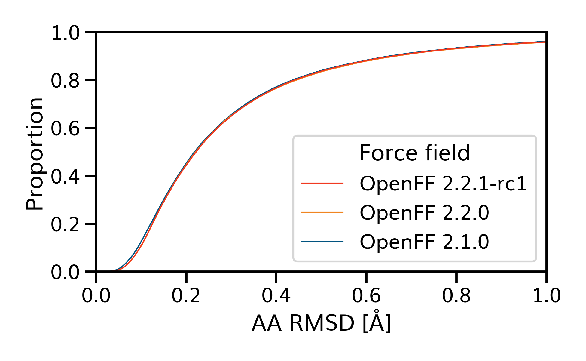


###  3.2. <a name='Sulfamideanglesremainsimilarto2.2.0'></a>Sulfamide angles remain similar to 2.2.0

Sulfamide angles improve relative to 2.1.0, and remain similar to 2.2.0.


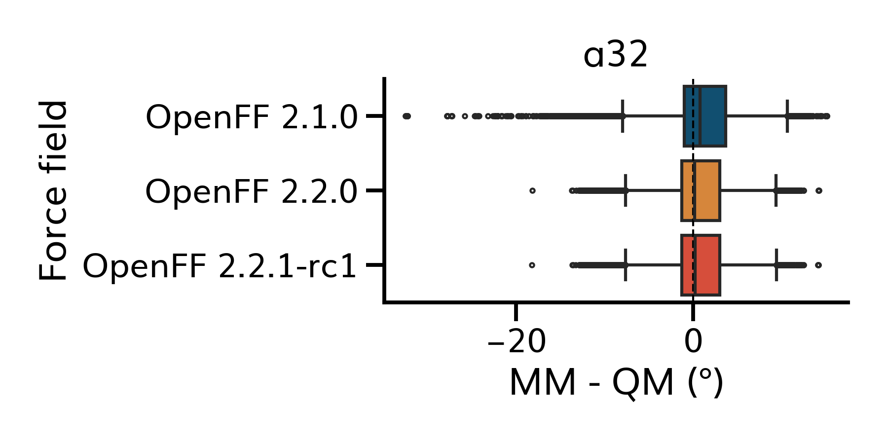

###  3.3. <a name='memberedringangleparametersremainsimilarto2.2.0'></a>3-membered ring angle parameters remain similar to 2.2.0

They broadly improve from 2.1.0, except the a4 parameter.

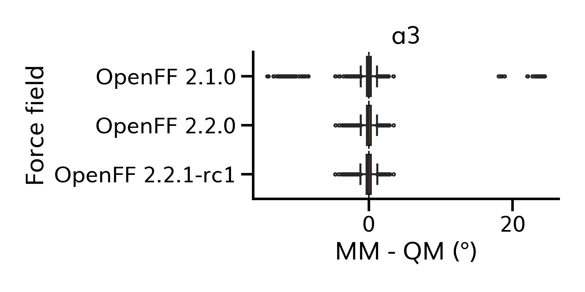
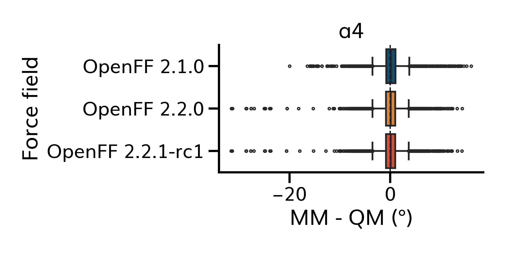
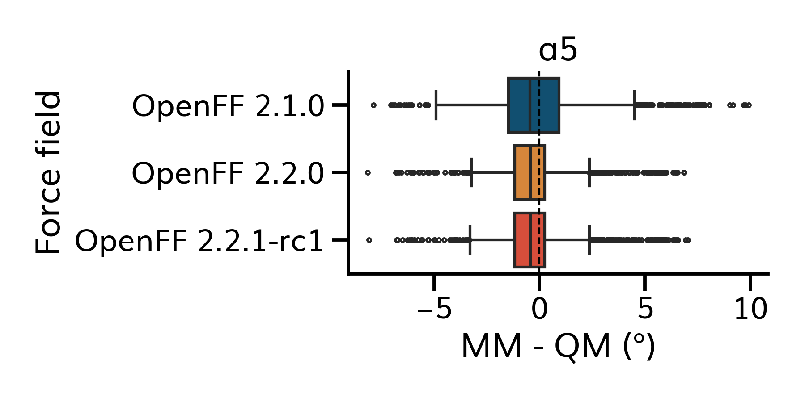
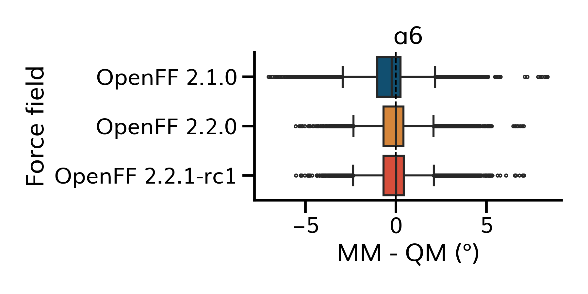

The a4 parameter outliers largely concern three unique molecules.

###  3.4. <a name='Linearanglesstaylinear.'></a>Linear angles stay linear.

a35 was not covered in either the testing or training data so
is not presented here.

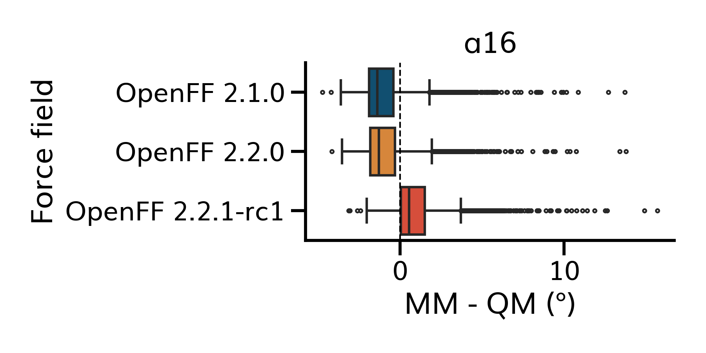
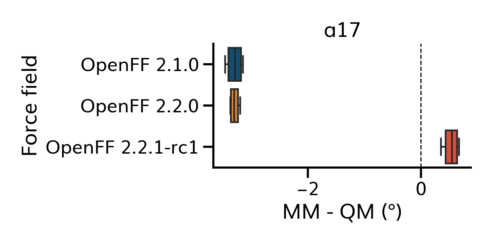
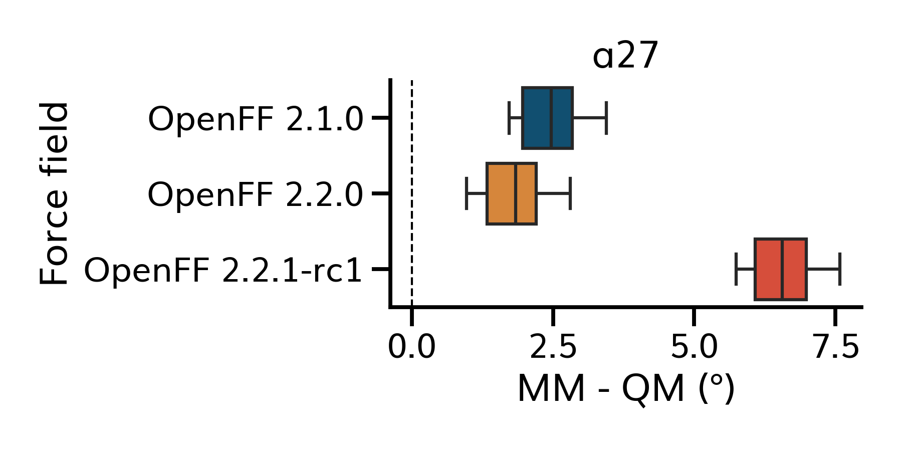

The apparent worse performance for a27 is due to QM angles less
than 175 degrees. All data points are various conformers of
2 unique molecules.


##  4. <a name='Parameterchanges'></a>Parameter changes

###  4.1. <a name='Bondimproperandpropertorsionparametersdontchangemuch'></a>Bond, improper, and proper torsion parameters don't change much

Parameter change plots can be seen in the
[parameter-changes](06_plot-figures/images/parameter-changes/)
directory. The scale of the y-axis for bonds,
propers, and improper torsion parameters don't change much.


###  4.2. <a name='Severalangleparameterschangesubstantially'></a>Several angle parameters change substantially

However, several angle parameters do change substantially.


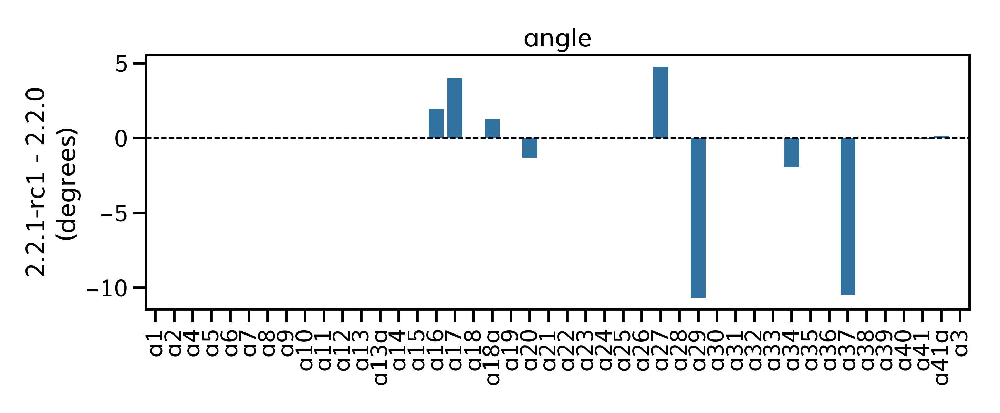

Below a table of equilibrium angles:

| Parameter | SMIRKS                                        | MSM | 2.2.0 | 2.2.1-rc1 |
|-----------|-----------------------------------------------|-----|-------|-----------|
| a18a      | `[*:1]@-[r!r6;#7X4,#7X3,#7X2-1:2]@-[*:3]`     | 95  | 94    | 95        |
| a20       | `[*:1]~[#7X3$(*~[#6X3,#6X2,#7X2+0]):2]~[*:3]` | 120 | 122   | 120       |
| a29       | `[#6X3,#7:1]~;@[#8;r:2]~;@[#6X3,#7:3]`        | 110 | 121   | 109       |
| a34       | `[*:1]~[#16X2,#16X3+1:2]~[*:3]`               | 98  | 100   | 98        |
| a37       | `[#6X3:1]-[#16X2:2]-[#6X3:3]`                 | 91  | 102   | 91        |

These differences appear largely to have improved the fit to QM angles.


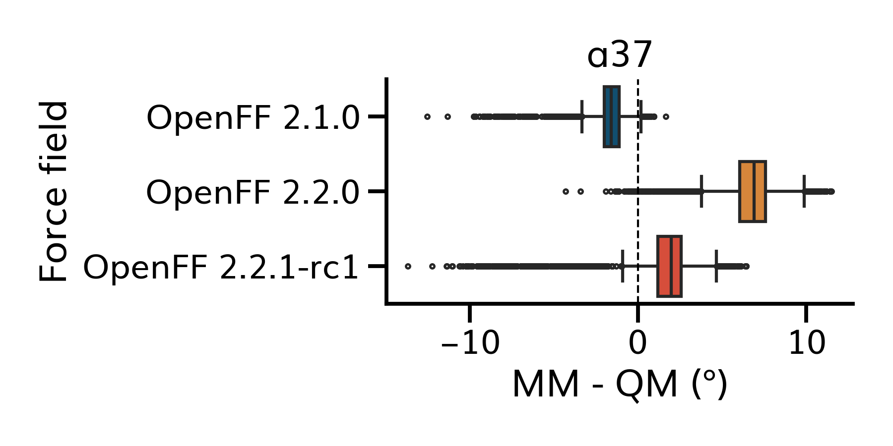

